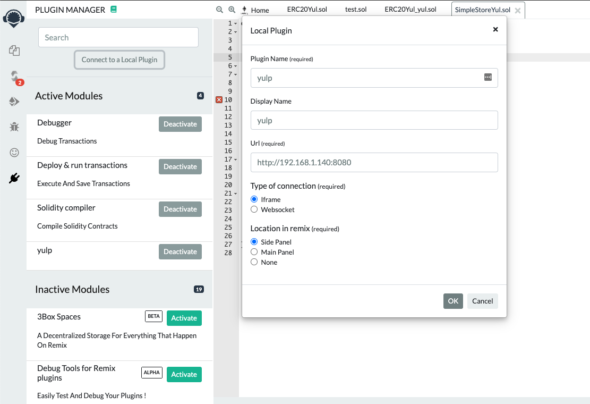
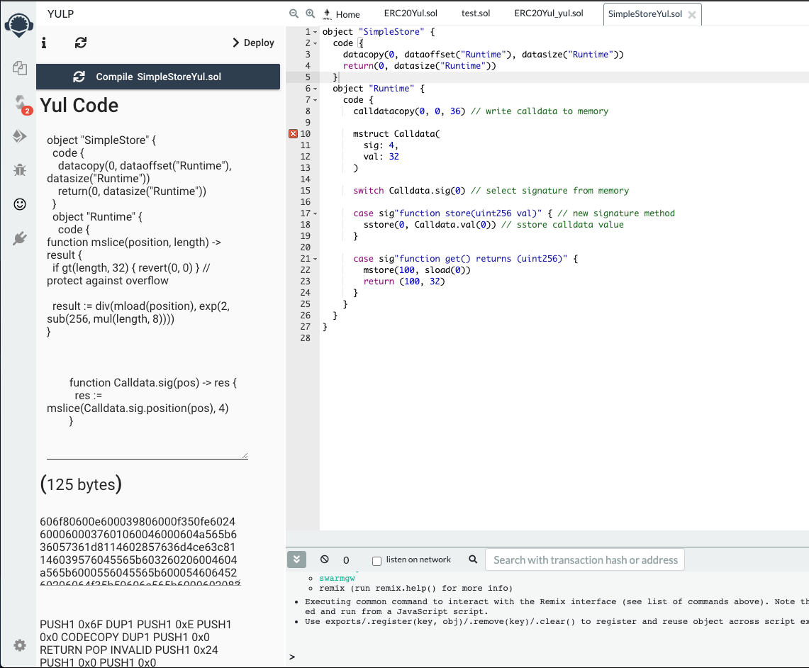
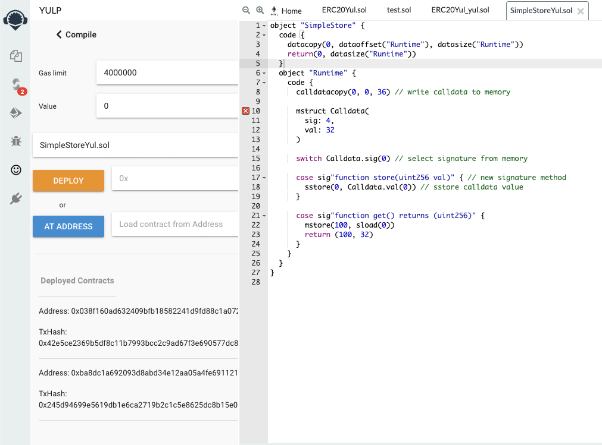

# Remix plugin for Yul+

In-work plugin for [Remix IDE](http://remix.ethereum.org) for compiling and deploying Yul+ smart contracts.

## Use

Start client (see Development). Connect to a local plugin, on Remix (has to be on http):

- name the plugin: `yulp`
- url: `http://localhost:8080`
- location: `Side Panel`



- write your Yul+ contract in Remix
- open the plugin & click the `Compile` button



- to deploy, go to the deployment step (top right)
- enter deployment arguments in hex format, if any
- click the `Deploy` button



## Development

### Client
```
cd client
npm install
```

#### Compiles and hot-reloads for development
```
npm run serve
```

#### Compiles and minifies for production
```
npm run build
```

#### Run your tests
```
npm run test
```

#### Lints and fixes files
```
npm run lint
```
