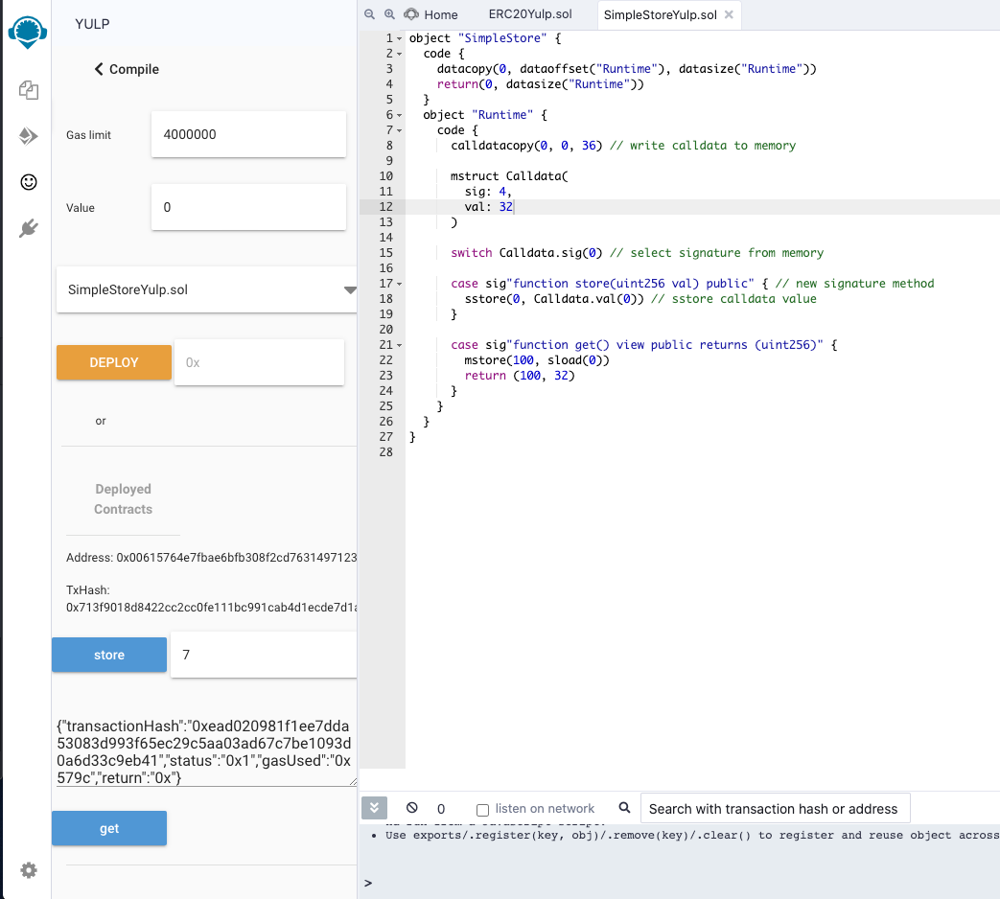

# Remix plugin for Yul+

In-work plugin for [Remix IDE](http://remix-alpha.ethereum.org) for compiling and deploying Yul+ smart contracts.

## Use

Start client (see Development). Connect to a local plugin, on Remix:

- works on http://remix-alpha.ethereum.org - Remix alpha version, on http
- activate the `Run and Deploy Transactions` plugin
- name the plugin: `yulp`
- url: `http://localhost:8080`
- location: `Side Panel`


- write your Yul+ contract in Remix
- open the plugin & click the `Compile` button


- to deploy, go to the deployment step (top right)
- enter deployment arguments in hex format, if any
- click the `Deploy` button


- you can interact with the deployed contract functions if you supply the full signatures in the source code - e.g. `case sig"function get() view public returns (uint256)"`



## Development

### Client
```
cd client
npm install
```

#### Compiles and hot-reloads for development
```
npm run serve
```

#### Compiles and minifies for production
```
npm run build
```

#### Run your tests
```
npm run test
```

#### Lints and fixes files
```
npm run lint
```
